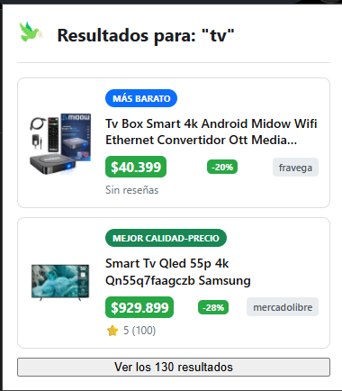
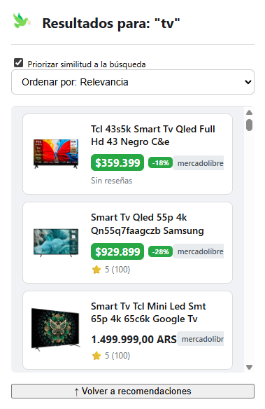
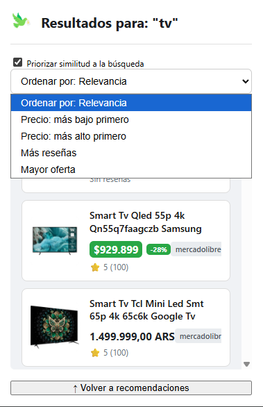

# Cheapy

**Cheapy** es un proyecto de **web scraping** que integra una **extensión de navegador** y un **servidor backend** para recolectar, organizar y mostrar información sobre productos buscados en tiendas online.

Su objetivo es brindar resultados **rápidos, reales y no patrocinados**, permitiendo comparar precios y características sin sesgos y desde una interfaz simple.

---

## 👥 Integrantes del proyecto

- **Nahuel Acuña**
- **Joaquín Arana**
- **Valentino Monteros**

---

## 🧩 Problema y solución

### ❗ Problema
Buscar un producto en múltiples tiendas online es un proceso **lento, repetitivo y frustrante**.  
Además, muchas plataformas de comparación de precios **privilegian tiendas patrocinadas**, ocultando alternativas más económicas o confiables.

### ✔️ Solución
Crear una **extensión inteligente** que:

- Detecta automáticamente lo que el usuario busca.
- Consulta múltiples tiendas reales mediante *web scraping*.
- Analiza y compara precios, reseñas y relevancia.
- Muestra al usuario **las mejores opciones**, sin publicidad ni promociones pagas.

---

## 🛠️ Tecnologías utilizadas

### **Frontend / Extensión**
- HTML  
- CSS  
- JavaScript  

### **Backend / Scraping**
- FastAPI  
- Uvicorn  
- Scrapy  
- BeautifulSoup4  
- httpx  
- Celery  
- Redis  
- Playwright  
- scrapy-playwright  

---

## 🧱 Arquitectura cliente-servidor

- **Extensión (Cliente):** interfaz liviana que envía consultas y muestra resultados.  
- **Servidor (Backend):** realiza scraping, procesa información y devuelve datos listos para mostrar.

---

## 🚀 Instalación y uso

### 1. Clonar el repositorio

```bash
git clone https://github.com/Code7C25/machine-learning
cd machine-learning/src/cheapy-backend
```

### 2. Configurar el servidor

```bash
# Crear entorno virtual
python -m venv venv

# Activar entorno
source venv/bin/activate   # Linux/Mac
venv\Scripts\activate      # Windows

# Instalar dependencias
pip install -r requirements.txt
```

### 3. Ejecutar el backend

En **dos terminales distintas**:

```bash
# Terminal 1
uvicorn api.app:app --reload --host 0.0.0.0
```

```bash
# Terminal 2
celery -A worker.celery_app worker --loglevel=info -P threads -c 4
```

### 4. Instalar la extensión en Chrome/Chromium

1. Abrir `chrome://extensions/`
2. Activar **Modo desarrollador**
3. Click en **Cargar descomprimida**
4. Seleccionar la carpeta `/extension`

### 5. Buscar un producto

- Abrir el popup de la extensión  
- Ingresar el nombre del producto  
- Cheapy realizará scraping y mostrará resultados optimizados

---

## 🖼️ Capturas del sistema

### Resultados recomendados



### Lista ordenable



### Opciones de filtrado


---

## 🎥 Video del proyecto

▶ **Tutorial de instalación:**  
https://youtu.be/iEI9h-xt8FQ?si=a8A7RKm9Te3W6Mxr

---

## 🌐 Enlaces oficiales

- **GitHub:** https://github.com/Code7C25/machine-learning  
- **Canal de YouTube:** https://www.youtube.com/@Cheapy_extension  
- **Instagram:** *AGREGAR*  
- **Deploy:** *No disponible por el momento*

---

## 📌 Estado del proyecto

Cheapy se encuentra en **fase de desarrollo funcional**, ya es capaz de obtener resultados reales desde Mercado Libre.

---

## 🔮 Próximos pasos

- Integración de más tiendas online  
- Mejoras en UI/UX de la extensión  
- Optimización del rendimiento del scraping  

---

## 🤝 Contribuciones

Cualquier sugerencia, reporte o mejora es bienvenida.
